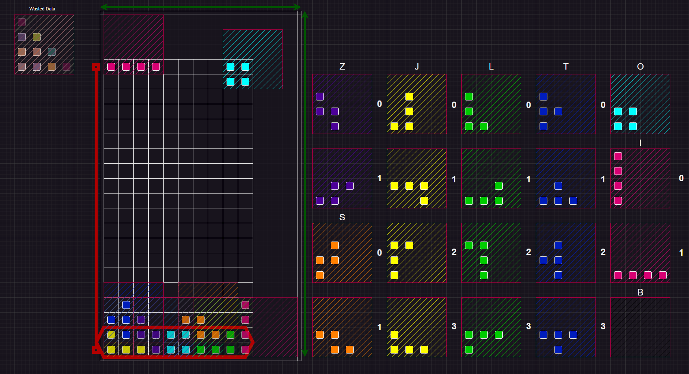

# Tetris

**Nothing sooths the soul like vibe coding Tetris in embedded Rust!**


Tetris (designed around tetreminos) was inspired by the physical game pentraminos which consisted of 12 pieces.

As a whole this will come in three parts, `the software`, `the firmware` and `the hardware`.

## Sweet Beginnings

### Under the hood

Why are we stacking tetreminos in a 10 tile wide grid... Because 13 tiles wide would be way too easy...



If you strip down the score, and only focus on the tiles themselves its black and white. Binary in fact! Treating the tiles as either on or off will simplify scoring a *Tetris* down the line.

So, how do we represent the 7 pieces we have to work with?

The image shows every piece as a`[4x4]` matrix of booleans. This way all the treatment of all pieces can be generalised and edge cases can be written as needed.

This method comes with several issues.

1) **Out of Bounds:**: As shown in the diagram there are 3 extremes where pieces overlap above, to the right or both.
2) **Overlapping Pieces**: Although the overlapping matrix look intimidating this may be trivial after all. The matrix serves as a placeholder while the piece falls through the dead space, every game tick (as the block falls) its future is the only region that needs to be updated saving compute!! After the pieces have landed I dont see any issues from treating all the pieces as one chunk.
3) **Piece Rotation**: My assumption is that rotation collision logic will fall under the same principle. Each tick if the player wants to rotate a piece the game will check if this piece will interfere with the surrounding region.
   - Square pieces dont require rotation
   - The line segment might have better performance if positioned on either centre of the matrix.
   - We'll see if the abstract pieces become a challege...
4) **The Tetris**: Famously, completing the line is how you progress in the game. With the max being 4, the more rows cleared in a single turn the more points you get!

### The Screen

*Paying hommage to the original invention the screen is rendered in ascii.*

>||||
>|-|-|-|
>|| ||

Implenenting a basic design that prints to the terminal is trivial.

But say you want to change the design...


It may not be the prettiest... But it sure saves doing it manually :')

```Rust

//Screen Size
const screen_width  :  usize  =  24; // Optimised for tiles 10 wide!
const screen_height :  usize  =  22; // Arbitrary


//State Machine Size
const logic_width   :  usize  = (GameScreen::screen_width  -4) /2; 
const logic_height  :  usize  = (GameScreen::screen_height -2);
const piece_limit   :  usize  = (GameScreen::logic_width * GameScreen::logic_height) /4 +1; 


//Rendering configuration
const B0L: char = '<'; // GameScreen::B0L
const B1M: char = '|'; // GameScreen::B1M
const B3R: char = '>'; // GameScreen::B3R

const BC0: char = '.'; // GameScreen::BC0
const BC1: char = ' '; // GameScreen::BC1

const BB0: char = '='; // GameScreen::BB0
const BB1: char = '\\';// GameScreen::BB1
const BB2: char = '/'; // GameScreen::BB2
const BB3: char = ' '; // GameScreen::BB3

```

Considering we're going embedded. It'll be pragmatic to plan around not using rust's `std` crate.

#### Rendering

## Todo

### Graphical

#### Score Screen

#### Next Piece Indicator

### Logic

#### Moving Pieces

#### Collisions

#### Clearing

### Hardware

#### Joystick

#### Screen

#### Sound

#### Controller

##### Power?

## RIP


## JK

